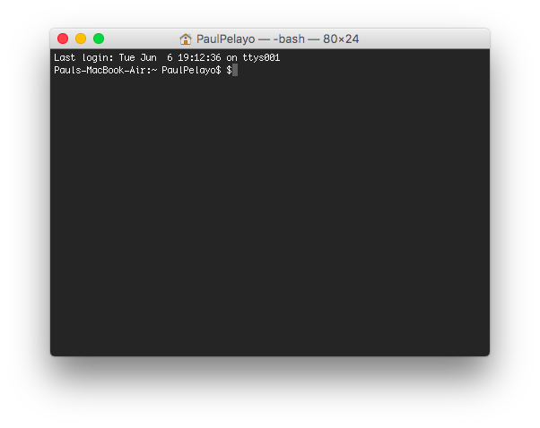

# Disclaimer
Please note this readme is intended for users that have little to no experience working with commonly used technologies (ie command line, github, python, API, etc).  For this reason many of the steps will be done without using a command line interface - although several steps will require command line use. This tutorial is also tailored for those using a mac with the Termainal command line application. You will note that many of the instructions are over-specific.  If you are familiar with using github and command line feel free to ignore any of the verbose steps and jump down to **Installing Dependencies**.  

# Getting Started
To download the project look for the green 'clone or download' button.  Click it and select 'Download Zip.'  Once the file has been downloaded, move it to your Desktop.  The foloder Google-Analytics-Prediction-Application-master should now be on the desktop.

### Installing Dependencies
##### Opening Terminal
Please note that from now on, a majority of the steps will involve using a command line application.  For Mac users, open up **Terminal**.  If you cannot find it, I reccomend doing a spotlight search to open the application (*cmd + spacebar + <type in 'Terminal'> + return*).  A window should open up that looks like this - the appearance may be white instead of black.  

##### Installing Anaconda
Several dependencies/libraries are required by this project in order for it to run locally.  The majority of them are bundled in Continuum's Anaconda package (Anaconda is a bundle of data science libraries and tools written in python).  Go to the link [here](https://www.continuum.io/downloads) and select the proper version for your computer.  For those not familiar with the commandline download the Python 3.6 Graphical Installer

Follow the instructions to download Anaconda.  Once complete we will  verify that everything was correctly installed.  Open up Terminal and type in the following command then press enter

    python
    
This should start python on your window from there enter the following and press enter

    import pandas
    
If a blank line appears next and no error appears, anaconda has been successfuly downloaded.  Type

    quit()
    
to exit python.

##### Installing Django
In the Terminal window enter the following command word for word
   
    conda install Django
and press return.  You should see the Terminal window give feedback indicating that something is installing.  When it finishes we will use the same steps from above to verify that Django was successfully installed.  Type

    python
wait for it to load

    import django
if no error

    quit()
    
##### Installing jsonfield
In order to download jsonfield we will need the use of a tool called *pip*.  To download pip, in the command line window type

    sudo easy_install pip
Note you may be asked for a password.  It is the same password that you use to log into your mac.  Once pip has successfully been installed type

    sudo pip install jsonfield
At this point all the needed python dependencies have been downloaded.

### Enabling the API
    
This project will require accesss to your google analytics account.  To set up the api go to the google api [site](https://developers.google.com/analytics/devguides/reporting/core/v4/quickstart/installed-py) for core reporting and follow steps 1 and 2.  After step 1 a file named *client_secrets.json* should be downloaded to your computer.  Move the file into a folder titled *ga_input*.  This folder is located in  *~/Desktop/Google-Analytics-Prediction-Application-master/prediction/ga_input*.  After you enter the command line input from step 2 you should be all set.  

### Running the Project
Back in terminal navigate to the project folder by typing

    cd ~/Desktop/Google-Analytics-Prediction-Application-master
    
Type the command
    
    ls

You should 2 items listed.  One folder titled prediction and one file named readme.md.  Navigate into the prediction folder.  Type ls again to ensure that you are in the right folder.  You should see several folders listed and one particular file titled 'manage.py'

    cd prediction
    ls
    
From here you will start the project by typing
    
    python manage.py runserver
    
You should see something like this [include photo here].  Open up the web browser of your choosing and type in the url in the folder.  This should take you to the homepage of the web application
    

    

